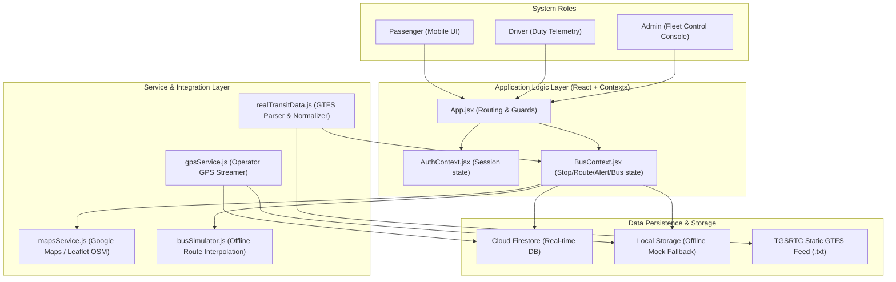
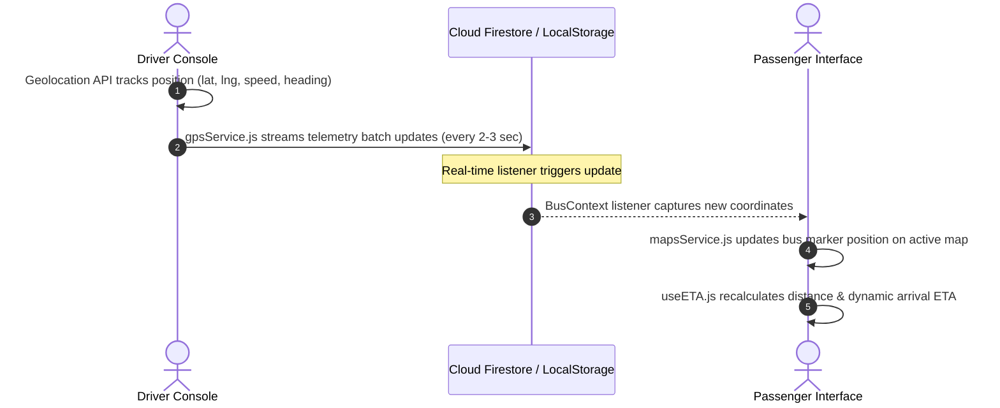

# CityBus - Live Public Transport Tracking & Fleet Management System

CityBus is a production-ready, full-featured web application designed to bring real-time transit telemetry, interactive route mapping, automated ETA calculation, and centralized administrative controls to public transport systems. 

The application is fully optimized to support regional transit data—specifically preconfigured for **TGSRTC** (Telangana State Road Transport Corporation) routes, stops, and schedules in Hyderabad—with complete offline capability, dual-mode database synchronization, and progressive web application (PWA) installation.

---

## 🌟 Key Capabilities

### 📱 1. Passenger (User) Portal
Designed with a premium, mobile-first interface utilizing soft shadows, rounded capsules, and a responsive layout:
* **Interactive Route Search**: Instantly query routes by selecting starting points and destination terminals.
* **Live GPS Tracking**: View the real-time location of active buses moving along their routes on an interactive map.
* **Automated ETA & Distances**: Calculates real-time distance and estimated times of arrival (ETA) for nearby buses using coordinates.
* **Stop schedules**: View the exact order of stops along a transit line, including active bus markers and schedule parameters.
* **Favorite Routes**: Save frequently used routes to the user profile for quick access.
* **Ticker Bulletins**: High-priority admin announcements scroll automatically across the bottom of the home screen to alert users of service changes.

### 🚏 2. Driver Duty Console
A dark-mode telemetry dashboard built specifically for drivers operating in high-vibration vehicle cabins:
* **Duty Authentication**: Secure login credentials provisioned specifically for transit operators.
* **Journey Management**: Start and end journey trips on preassigned buses and routes.
* **Live Telemetry Broadcast**: Streams real-time GPS coordinates, vehicle speed, heading, and accuracy using the browser's native Geolocation API.
* **Passenger Logging**: Simple, large touch-friendly buttons for the driver to increment/decrement the passenger load factor in real-time.
* **Duty Summaries**: View elapsed time, total trip distance covered, and peak passenger loads upon completing a duty trip.

### 🖥️ 3. Administrative Control Center
A desktop-optimized dashboard that provides transit authorities with full operational oversight:
* **Fleet Control Room**: Real-time map displaying all active buses moving throughout the regional grid.
* **System Metrics**: Live counts of active buses, operational lines, drivers on duty, and registered passengers.
* **Database Seeding Panel**: Single-click controls to seed Firestore databases or local storage with standard datasets and driver accounts.
* **CRUD Management Editors**: Complete data views to add, modify, or remove transit assets:
  * **Buses**: Register vehicles with license numbers, capacity, and current routes.
  * **Routes**: Manage lines, route numbers, stop sequences, and durations.
  * **Stops**: Define stop locations with exact coordinates, descriptions, and nearby landmarks.
  * **Drivers**: Link drivers to specific buses and routes, and provision authentication accounts.
  * **Announcements**: Post service disruptions or emergency bulletins.
* **Incident Ticket Tracker**: Review and resolve passenger-submitted complaints and vehicle telemetry alerts.

---

## ⚙️ Technical Architecture & Modes

### 📊 System Architecture



### 🛰️ Telemetry Flow (Real-Time GPS Synchronization)



### 🔄 Dual-Mode Sync & Offline-First Design
CityBus operates in two distinct synchronization modes depending on your configuration:
1. **Firebase Mode**: If a valid Firebase project is detected in `.env`, the system establishes real-time Firestore synchronization. Bus positions broadcasted by drivers stream directly to passenger maps.
2. **Local Mock Mode**: If Firebase configurations are absent or using placeholder keys, the app gracefully falls back to **Local Mock Storage Mode**. The system auto-seeds local storage with standard datasets and runs a client-side simulation engine ([busSimulator.js](file:///f:/Transport/src/simulation/busSimulator.js)) that moves buses along routes, board passengers at terminals, and broadcasts mock coordinates.

### 🗺️ Smart Map Adaptability
The application includes a map adapter system ([mapsService.js](file:///f:/Transport/src/services/mapsService.js)). If Google Maps API keys are provided, it loads high-performance Google Maps. If the key is missing, or the user's connection drops into low bandwidth, the system automatically swaps to a lightweight Leaflet map interface using OpenStreetMap tiles.

### 📦 GTFS Data Normalization
Supports official static transit feeds. Administrators can download GTFS data containing `routes.txt`, `stops.txt`, `trips.txt`, and `stop_times.txt` directly from the TGSRTC Open Data Portal and ingest it using our built-in CSV parser and normalizer ([realTransitData.js](file:///f:/Transport/src/services/realTransitData.js)).

---

## 📂 Project Directory Structure

```text
CityBus/
├── .env.example                # Template configuration file for Firebase/Google Maps
├── firestore.rules             # Security rules for collections (buses, routes, users, reports)
├── firestore.indexes.json      # Composite query indexes for Firestore
├── index.html                  # HTML entrypoint containing PWA install catch scripts
├── tailwind.config.js          # Typography, layout borders, and HSL custom colors
├── vite.config.js              # Vite configuration with PWA service worker configurations
├── src/
│   ├── main.jsx                # Application mounting point
│   ├── App.jsx                 # Route definitions (lazy-loaded pages, guards, and toast settings)
│   ├── index.css               # Core styling and premium layout animation rules
│   ├── components/             # Reusable modular UI components
│   │   ├── admin/              # Layout wraps and navigation bars for administrators
│   │   ├── user/               # Bottom bars, navigation drawers, and widgets for passengers
│   │   └── shared/             # Loaders, skeletons, error boundaries, and route guards
│   ├── contexts/
│   │   ├── AuthContext.jsx     # Handles authentication states (Passenger, Driver, Admin)
│   │   ├── BusContext.jsx      # Holds collection states (buses, routes, stops, announcements)
│   │   └── MapContext.jsx      # Map display configurations and hooks
│   ├── hooks/
│   │   ├── useAllBuses.js      # Synchronizes all live bus markers
│   │   ├── useConnectionQuality.js # Detects network slowdowns to auto-swap maps
│   │   ├── useETA.js           # Calculates real-time distance ETAs
│   │   ├── useGeolocation.js   # Watches and registers GPS coordinate changes
│   │   └── useRealTimeBus.js   # Streams telemetry for individual buses
│   ├── pages/
│   │   ├── admin/              # Dashboard, fleet management, and driver management
│   │   ├── driver/             # Driver dashboard and operator login screens
│   │   └── user/               # Home, live tracking map, profiles, and alert logs
│   ├── services/
│   │   ├── firebase.js         # Firebase Auth/Firestore initialization & seeding scripts
│   │   ├── mapsService.js      # Dynamic wrapper for Google Maps and Leaflet engines
│   │   ├── realTransitData.js  # CSV GTFS Parser, normalizer, and legacy BATS proxy client
│   │   ├── seedData.js         # Hyderabad dataset entry point
│   │   └── tsrtcApi.js         # External transit API integrations
│   ├── simulation/
│   │   └── busSimulator.js     # Simulated movement engine for offline testing
│   └── utils/
│       └── geoUtils.js         # Haversine distance, bearings, and location interpolation
```

---

## 🚀 Getting Started

### 📋 Prerequisites
* Node.js (version 18 or higher recommended)
* npm (Node Package Manager)

### 📥 1. Installation
1. Clone the repository to your local machine:
   ```bash
   git clone <repository-url>
   ```
2. Navigate to the project root directory:
   ```bash
   cd Transport
   ```
3. Install all dependencies:
   ```bash
   npm install
   ```

### 🔧 2. Configuration Setup
1. Copy the environment variables template file:
   ```bash
   copy .env.example .env
   ```
2. Open the newly created `.env` file and fill in your API credentials:
   * **Firebase**: Create a project in the Firebase Console, enable Authentication (Email/Password) and Cloud Firestore, then paste your credentials.
   * **Google Maps**: Generate an API Key from the Google Cloud Console with Maps JavaScript API enabled.
   * **Transit Mode**: Keep `VITE_TRANSIT_DATA_SOURCE=seed` for mock testing, or change it to `tgsrtc-gtfs` if importing real GTFS data.

### 🛢️ 3. Seeding the Data (Firestore / Local Storage)
1. Run the local development server:
   ```bash
   npm run dev
   ```
2. Open your browser and navigate to the application:
   * URL: `http://localhost:5173/`
3. Log in with the default **Admin account**:
   * Email: `admin@citybus.in`
   * Password: `admin-uid` (or register a new user, and update their role to `admin` in the database).
4. Navigate to the **Admin Dashboard** (`/admin/dashboard`).
5. Scroll down to the **System Setup & Seeding Control Panel** and click:
   * **Seed Hyderabad Datasets**: Creates all initial route lines, bus stops, buses, and notifications.
   * **Provision Driver Accounts**: Generates 15 default driver authentication logins.

---

## 🔑 Default Accounts (For Testing)

If operating in **Local Mock Storage Mode** or after completing the seeding steps in Firebase Mode, you can test the system roles using these preconfigured accounts:

| Role | Username / Email | Password | Assigned Vehicle | Assigned Route |
| :--- | :--- | :--- | :--- | :--- |
| **Administrator** | `admin@citybus.in` | `admin-uid` | *N/A* | *N/A* |
| **Transit Driver 1** | `driver1@citybus.gov.in` | `CityBus@2024` | `TS-09-UD-1200` | CBS to Unkal Lake |
| **Transit Driver 2** | `driver2@citybus.gov.in` | `CityBus@2024` | `TS-09-UD-3400` | CBS to SDM Hospital |
| **Transit Driver 3** | `driver3@citybus.gov.in` | `CityBus@2024` | `TS-09-UD-5600` | Secunderabad to Charminar |

---

## 🛠️ Code Reference Links

This list highlights key files inside the project structure:

* **Entrypoint & Routing**:
  * [index.html](file:///f:/Transport/index.html) — Application base frame.
  * [src/main.jsx](file:///f:/Transport/src/main.jsx) — Core runtime bootstrap.
  * [src/App.jsx](file:///f:/Transport/src/App.jsx) — App routing guards and layout wraps.
* **State Contexts**:
  * [src/contexts/BusContext.jsx](file:///f:/Transport/src/contexts/BusContext.jsx) — State manager for stops, routes, alerts, and active buses.
  * [src/contexts/AuthContext.jsx](file:///f:/Transport/src/contexts/AuthContext.jsx) — User credentials and session states.
* **Services**:
  * [src/services/firebase.js](file:///f:/Transport/src/services/firebase.js) — Firebase connection, batch data writer, and account creator.
  * [src/services/mapsService.js](file:///f:/Transport/src/services/mapsService.js) — Google Maps and Leaflet loaders/adapters.
  * [src/services/realTransitData.js](file:///f:/Transport/src/services/realTransitData.js) — GTFS parser/normalizer and legacy BATS proxy.
  * [src/services/seedData.js](file:///f:/Transport/src/services/seedData.js) — Main export for seed dataset metadata.
  * [src/services/hyderabadTransitData.js](file:///f:/Transport/src/services/hyderabadTransitData.js) — Bundled Hyderabad stops and routes coordinates.
* **Simulator**:
  * [src/simulation/busSimulator.js](file:///f:/Transport/src/simulation/busSimulator.js) — Mock position interpolation engine.
* **Portals & Dashboards**:
  * [src/pages/user/Home.jsx](file:///f:/Transport/src/pages/user/Home.jsx) — Passenger home dashboard with autocomplete and quick actions.
  * [src/pages/user/Tracking.jsx](file:///f:/Transport/src/pages/user/Tracking.jsx) — Passenger live map bus-tracking screen.
  * [src/pages/driver/DriverDashboard.jsx](file:///f:/Transport/src/pages/driver/DriverDashboard.jsx) — Operator dashboard with GPS broadcast hooks.
  * [src/pages/admin/Dashboard.jsx](file:///f:/Transport/src/pages/admin/Dashboard.jsx) — Admin control room and system monitoring.
* **Configurations**:
  * [.env.example](file:///f:/Transport/.env.example) — Configuration setup variables.
  * [package.json](file:///f:/Transport/package.json) — NPM scripts and dependencies list.
  * [REAL_DATA.md](file:///f:/Transport/REAL_DATA.md) — Real TGSRTC GTFS setup guide.

---

## 🔒 Security & Deployment Rules

1. **Security Rules**: Before deploying your Firestore database to production, ensure that you load the policies specified in [firestore.rules](file:///f:/Transport/firestore.rules).
2. **HTTPS Context**: Real-time Geolocation requires a secure HTTPS protocol. Ensure your hosting server is configured with SSL certificates so the Driver Dashboard can successfully initialize GPS tracking.
