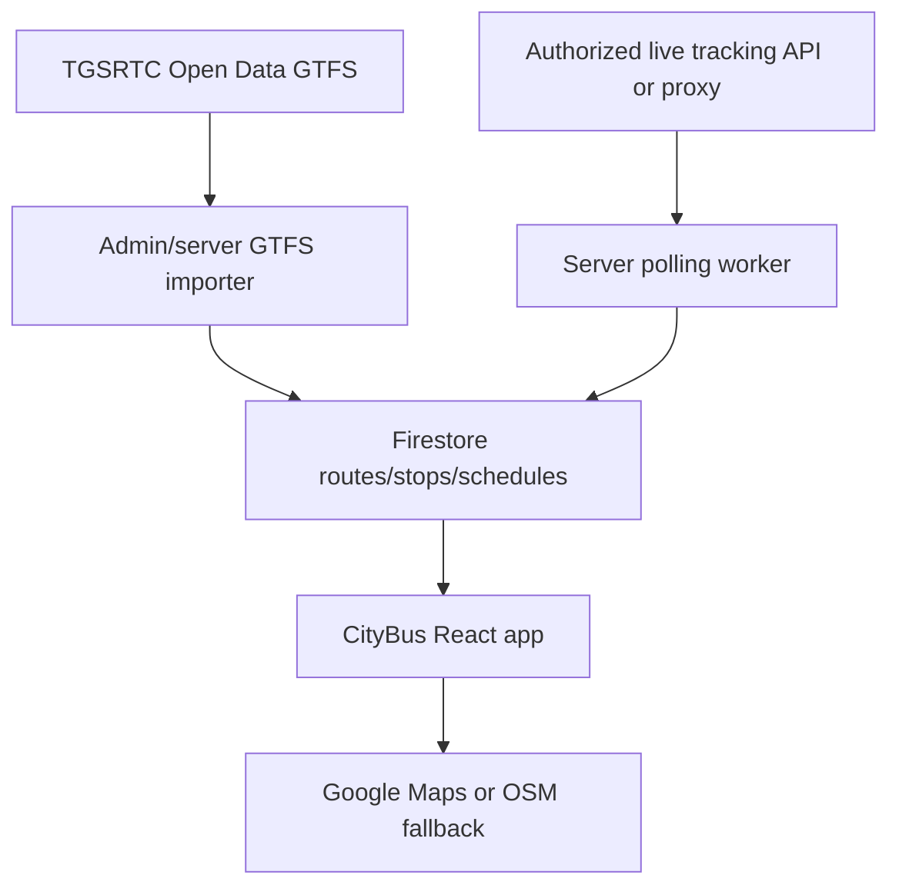

# Real Transit Data Setup

This project can use real TGSRTC static transit data through the official GTFS open-data path.

## Official TGSRTC Static Data

TGSRTC publishes static transit information such as schedules, fares, routes, and stops in GTFS format from its Open Data page:

https://tgsrtc.telangana.gov.in/open-data

The page states that:

- Static data is published in General Transit Feed Specification (GTFS).
- The data is free and non-exclusive under TGSRTC's terms.
- Attribution is required: `Contains data provided by TGSRTC`.
- TGSRTC does not guarantee freshness or uninterrupted access.
- Download access currently goes through a Google Form linked from that page.

## App Configuration

Unzip the GTFS package so these files are available together:

- `routes.txt`
- `stops.txt`
- `trips.txt`
- `stop_times.txt`

For local development, place them under:

```text
public/gtfs/routes.txt
public/gtfs/stops.txt
public/gtfs/trips.txt
public/gtfs/stop_times.txt
```

Then configure:

```env
VITE_TRANSIT_DATA_SOURCE=tgsrtc-gtfs
VITE_TGSRTC_GTFS_BASE_URL=/gtfs
```

For hosted data, point `VITE_TGSRTC_GTFS_BASE_URL` to a folder URL containing those same files.

## Live Gamyam / Vehicle Tracking

TGSRTC's public website describes the Gamyam app as offering real-time bus tracking for all buses, but I did not find an official public Gamyam API specification in the TGSRTC site or GitHub search.

GitHub cross-check:

- `TGSRTC Gamyam` / `TSRTC Gamyam` repository search returned no direct public API repo.
- Broader `TSRTC bus tracking` search found older public projects, strongest example:
  - https://github.com/FaraazAshraf/tsrtc-tracking
- That project references a legacy TSRTC BATS endpoint pattern:
  - `http://125.16.1.204:8080/bats/appQuery.do?query={trackingId}&flag=21`
  - `flag=13` was used there for route/stop progress.

Treat the legacy BATS endpoint as unofficial and potentially obsolete. It is HTTP-only, likely blocked by browser CORS/mixed-content rules, and may require permission from TGSRTC for production use.

If you have authorization and want to use it, expose it through your own backend proxy and configure:

```env
VITE_TSRTC_LEGACY_BATS_PROXY_URL=https://your-domain.example/tgsrtc-bats
```

The frontend service `fetchLegacyTsrtcBusStatus(trackingId)` is available in:

```text
src/services/realTransitData.js
```

## Recommended Production Architecture



Do not ship private API keys, hidden endpoint credentials, or direct legacy HTTP calls in the browser.
